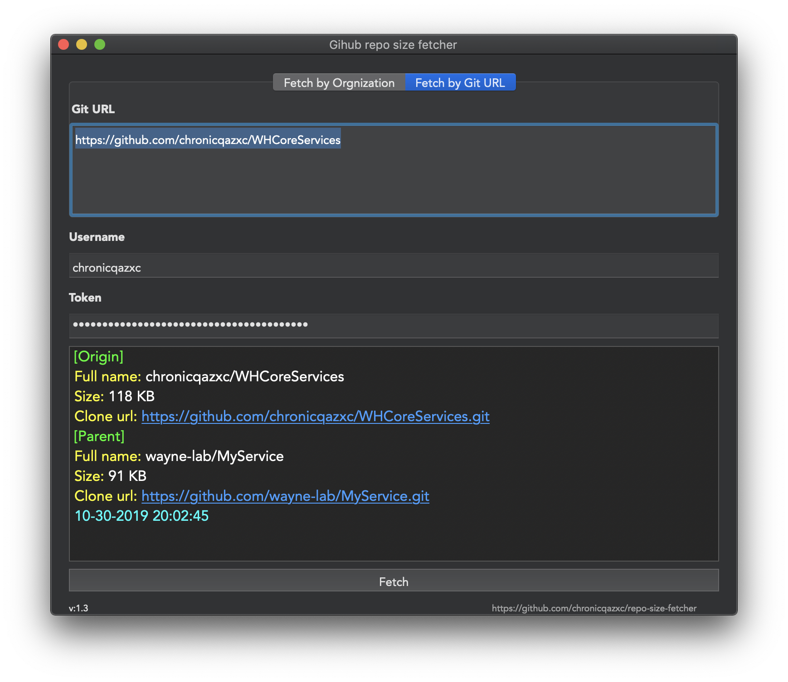
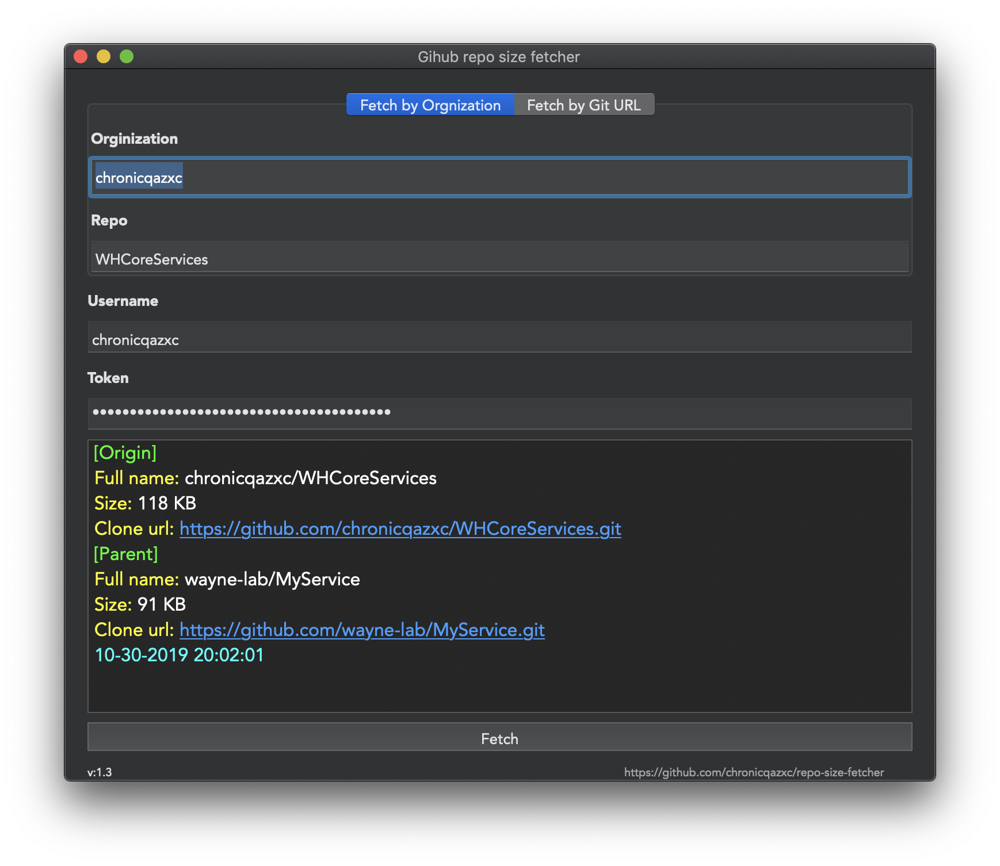

# repo-size-fetcher
Get size of repos on GitHub quickly!

## Why I made this tool
The reason to built this tool is to analysis repo's size in order to facilitiate the Pos's fetch speed.

## How to use
There are two modes to fetch repo's size, you can choose any type which is convenience to you.
1. By orginization and repo's name.
2. By Git URL.

## Hot to build
```shell
carthage update --cache-builds --platform osx
```

## Dependencies   
* [WHCoreServices](https://github.com/chronicqazxc/WHCoreServices)
* [WHPromise](https://github.com/chronicqazxc/WHPromise)

|  | 
| ------ | 
| fetch by **git url** |
| fetch by **orgnization/repo** |

## Author
[Wayne Hsiao](mailto:chronicqazxc@gmail.com)
